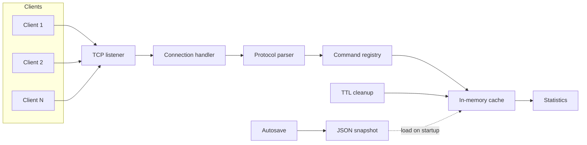
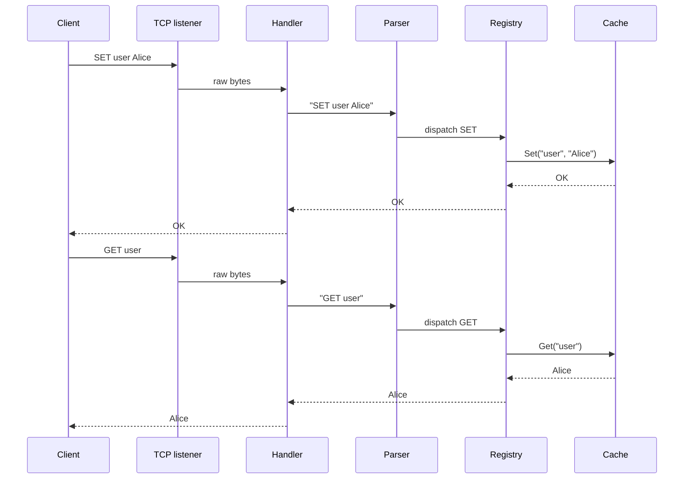
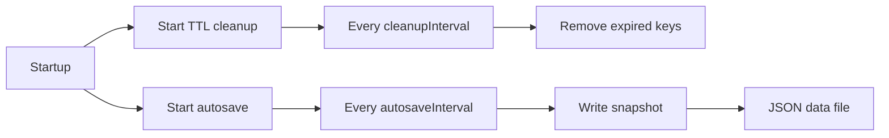
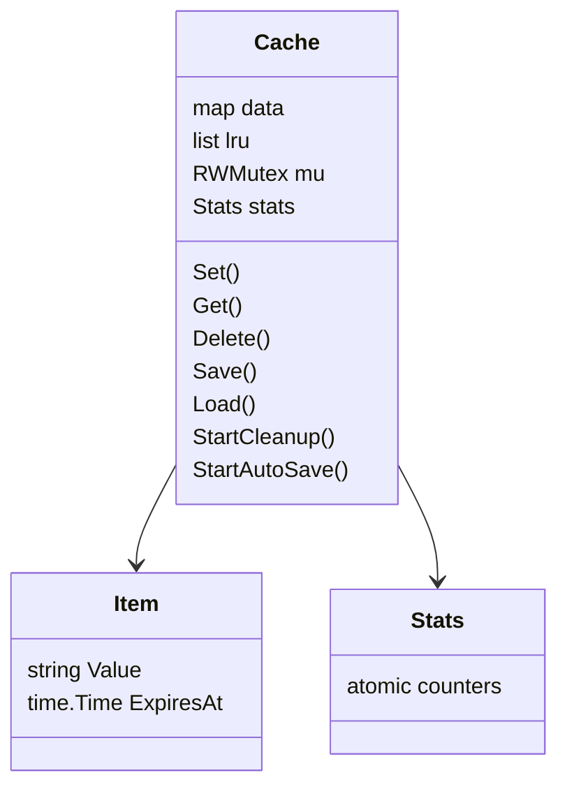

# ⚡ CacheDock
A high-performance Go TCP cache server with LRU eviction, TTL support, persistence, and built-in load testing

[](https://go.dev/)
[](#-tcp-command-reference)
[](#%EF%B8%8F-configuration)
[](testing/README.md)
[](#-license)

A lightweight, concurrent Go cache server that accepts line-based TCP commands. It provides in-memory storage, LRU eviction, TTL expiry, JSON snapshots, runtime statistics, YAML configuration, and documented performance testing.

> **Tags:** `golang` · `tcp-server` · `in-memory-cache` · `lru` · `ttl` · `concurrency` · `yaml-config` · `benchmarking`

## Table of contents

- [Features](#-features)
- [Architecture](#%EF%B8%8F-architecture)
- [Quick start](#-quick-start)
- [Configuration](#%EF%B8%8F-configuration)
- [TCP command reference](#-tcp-command-reference)
- [Testing](#-testing)
- [Project layout](#-project-layout)
- [Measured local capacity](#-measured-local-capacity)
- [License](#-license)

## ✨ Features

- **TCP protocol** — newline-delimited commands over persistent connections.
- **In-memory cache** — map-based key lookup backed by an LRU list.
- **Bounded capacity** — configurable `maxKeys` limit with least-recently-used eviction.
- **TTL expiration** — optional per-key TTL plus background removal of expired values.
- **Persistence** — automatic JSON snapshots and reload on startup.
- **Statistics** — request, hit, miss, set, and delete counters through `INFO`.
- **YAML configuration** — reads `config/config.yaml`; supported environment variables override selected settings.
- **Verified testing** — unit, integration, benchmark, load, and real local-TCP stress testing are documented in [`testing/`](testing/README.md).

## 🏗️ Architecture

### System overview



### Request flow



### Background jobs



### Cache internals



## 🚀 Quick start

### Prerequisites

- Go 1.26.5 or a compatible Go toolchain

### Start the server

Run this from the project root—the directory that contains `go.mod`:

```powershell
go run ./cmd/server
```

The server reads [`config/config.yaml`](config/config.yaml), creates the configured snapshot directory if needed, restores any existing snapshot, and listens on the configured TCP port.

### Try it

Connect with a TCP client such as `telnet`, `nc`, or your own application, then send one command per line:

```text
SET user Alice
GET user
DELETE user
GET user
```

Expected responses:

```text
OK
Alice
OK
NOT_FOUND
```

## ⚙️ Configuration

The default server configuration is [`config/config.yaml`](config/config.yaml):

```yaml
port: 8080
maxKeys: 1000
cleanupInterval: 1s
autosaveInterval: 30s
dataFile: data/cache.json
```

| Field | Description |
| --- | --- |
| `port` | TCP listening port. The server binds to all local interfaces (`:<port>`). |
| `maxKeys` | Maximum key count before LRU eviction. Must be greater than zero. |
| `cleanupInterval` | Expired-key cleanup interval, using Go duration syntax. |
| `autosaveInterval` | Snapshot write interval, using Go duration syntax. |
| `dataFile` | JSON snapshot location. The parent directory is created automatically. |

The loader supports this flat `key: value` YAML format. Missing, malformed, or unknown configuration values stop startup with an error.

### Environment overrides

| Variable | Overrides |
| --- | --- |
| `CONFIG_FILE` | YAML configuration file location |
| `PORT` | `port` |
| `DATA_FILE` | `dataFile` |
| `CLEANUP_INTERVAL` | `cleanupInterval` |
| `AUTOSAVE_INTERVAL` | `autosaveInterval` |

Example:

```powershell
$env:PORT='9090'
go run ./cmd/server
```

## 📡 TCP command reference

Commands are case-insensitive. Send one newline-terminated command at a time. Keys and values cannot contain spaces.

| Command | Description | Example | Response |
| --- | --- | --- | --- |
| `PING` | Checks that the server is responsive. | `PING` | `PONG` |
| `SET <key> <value> [ttl_seconds]` | Stores a value, optionally with a TTL in seconds. | `SET session active 60` | `OK` |
| `GET <key>` | Retrieves a stored value. | `GET session` | value or `NOT_FOUND` |
| `DELETE <key>` | Removes a key when present. | `DELETE session` | `OK` |
| `INFO` | Returns cache operation counters. | `INFO` | `Requests=… Hits=… Misses=… Sets=… Deletes=…` |

Unknown commands return `ERROR unknown command`. Invalid arguments return an `ERROR usage: ...` response.

## 🧪 Testing

Run the normal test suite:

```powershell
go test ./...
```

Run cache performance benchmarks:

```powershell
go test -run '^$' -bench '^(BenchmarkSetOverwrite|BenchmarkGetHit|BenchmarkMixedParallel)$' -benchtime=3s -benchmem -count=3 ./internal/cache
```

Run the concurrent protocol-load benchmark:

```powershell
go test -run '^$' -bench '^BenchmarkProtocolRoundTripParallel$' -benchtime=3s -benchmem -count=3 ./internal/handler
```

Run the opt-in real local-TCP stress test:

```powershell
$env:RUN_STRESS='1'; go test -run '^TestTCPStress$' -v ./internal/handler
```

The detailed guides are in [`testing/`](testing/README.md); the full measurements are in [`PERFORMANCE_TEST_REPORT.md`](PERFORMANCE_TEST_REPORT.md).

> **Race detector note:** `go test -race ./...` could not run locally because the installed Windows C compiler lacks 64-bit support. Install a supported 64-bit C compiler, then rerun the command.

## 📁 Project layout

```text
cache/
├── cmd/server/              server entry point
├── config/                  YAML loader, config file, and tests
├── data/                    runtime JSON snapshots
├── internal/
│   ├── cache/               cache, TTL cleanup, LRU, persistence, benchmarks
│   ├── commands/            PING, SET, GET, DELETE, and INFO commands
│   ├── handler/             TCP connection handling, load and stress tests
│   ├── protocol/            request parsing
│   ├── statistics/          atomic cache counters
│   └── utils/               command dispatch
├── testing/                 testing guides by category
├── PERFORMANCE_TEST_REPORT.md
├── go.mod
└── readme.md
```

## 📊 Measured local capacity

| Scenario | Result |
| --- | ---: |
| Cache GET hit | ~10.4M ops/s |
| Concurrent cache mix (75% GET / 25% SET) | ~4.53M ops/s |
| Protocol load benchmark | ~1.13M commands/s |
| Real local-TCP stress test | ~216K commands/s |

These are controlled local measurements, not production network guarantees. Review [`PERFORMANCE_TEST_REPORT.md`](PERFORMANCE_TEST_REPORT.md) before setting deployment capacity limits.

## 📄 License

No license file is currently included. Add one before distributing or using this project as an open-source dependency.
